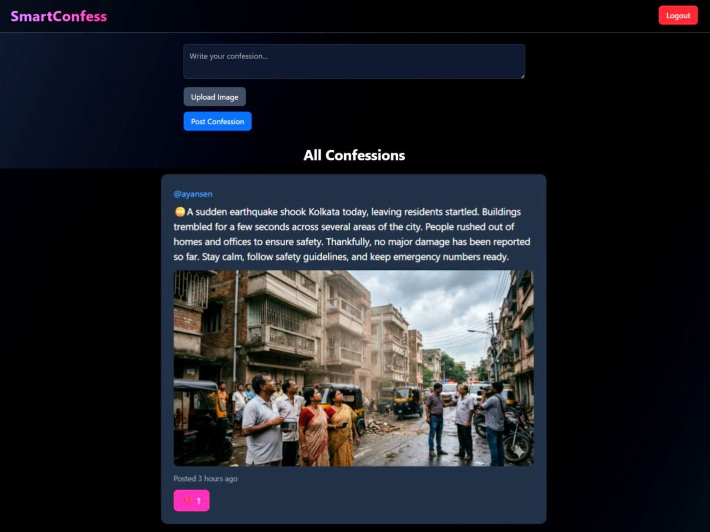

# 🚀 SmartConfess

SmartConfess is a full-stack social microblogging platform where users can post confessions, upload images, like posts, follow other users, and manage personal profiles.

Built using the MERN stack with JWT authentication and image upload support.

---

## 🌟 Live Features

- 🔐 Secure JWT Authentication
- 📝 Create / Edit / Delete Confessions
- 🖼 Image Upload Support (Multer)
- ❤️ Like / Unlike System
- 👥 Follow / Unfollow Users
- 👤 Dynamic Profile Pages
- 🔎 Search Functionality
- 🕒 Relative Time Display
- 📱 Responsive UI (Tailwind CSS)

---

## 📸 Project Preview



## 🛠 Tech Stack

### Frontend
- React (Vite)
- Tailwind CSS
- React Router DOM
- Axios
- Day.js

### Backend
- Node.js
- Express.js
- MongoDB
- Mongoose
- JWT Authentication
- Multer (File Upload)
- CORS
- dotenv

---

## 📂 Project Structure

```
SmartConfess/
│
├── client/               # Frontend (React + Vite)
│
├── controllers/          # Business Logic
├── routes/               # API Routes
├── models/               # MongoDB Schemas
├── middleware/           # Auth & Error Handling
├── config/               # Database Connection
│
├── uploads/              # Uploaded Images (ignored in git)
├── server.js             # Express App Entry
└── README.md
```

---

## ⚙️ Installation & Setup

### 1️⃣ Clone the Repository

```bash
git clone https://github.com/YOUR_USERNAME/smartconfess.git
cd smartconfess
```

---

### 2️⃣ Install Backend Dependencies

```bash
npm install
```

---

### 3️⃣ Install Frontend Dependencies

```bash
cd client
npm install
```

---

## 🔐 Environment Variables

Create a `.env` file in the root folder:

```
PORT=3000
MONGO_URI=your_mongodb_connection_string
JWT_SECRET=your_super_secret_key
```

---

## ▶️ Run Locally

### Backend

```bash
npm start
```

### Frontend

```bash
cd client
npm run dev
```

Frontend runs on:
```
http://localhost:5173
```

Backend runs on:
```
http://localhost:3000
```

---

## 🔒 Security

- Passwords are hashed using bcrypt
- JWT authentication protects private routes
- Environment variables secured via `.env`
- `.gitignore` configured to protect sensitive data

---

## 🚀 Deployment

Recommended Deployment Stack:

- Frontend → Vercel
- Backend → Render / Railway
- Database → MongoDB Atlas

---

## 🎯 Future Improvements

- Real-time notifications (Socket.io)
- Pagination
- Cloudinary image hosting
- Comment reply system
- Admin dashboard
- Dark/Light theme toggle

---

## 👨‍💻 Author

Arijit Sen  
BTech – Electronics & Communication Engineering  
Full Stack Developer  

---

## 📄 License

This project is open-source and available under the MIT License.

---

⭐ If you found this project helpful, please consider giving it a star on GitHub!

Your support motivates further development and improvements 🚀